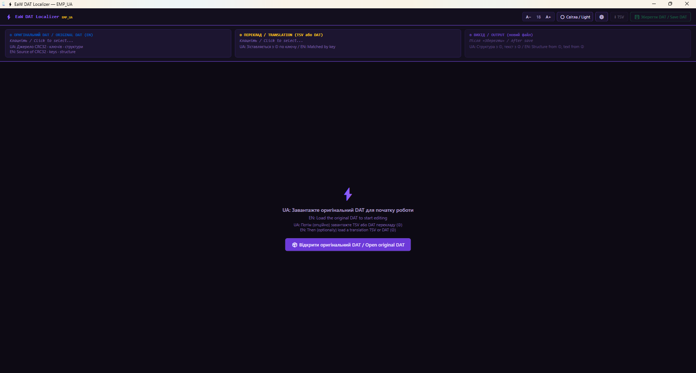
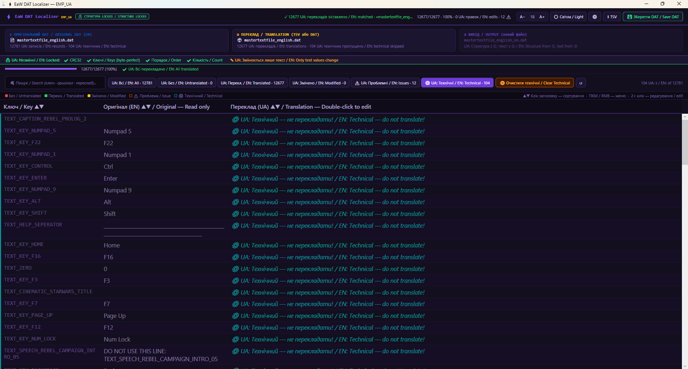
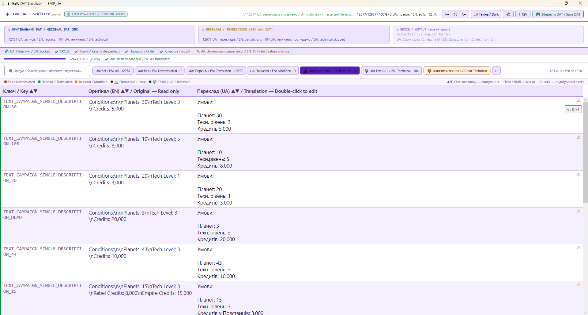
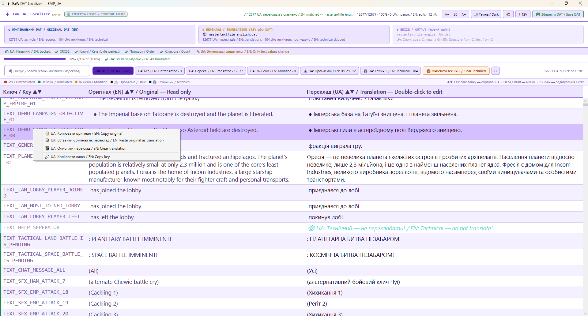
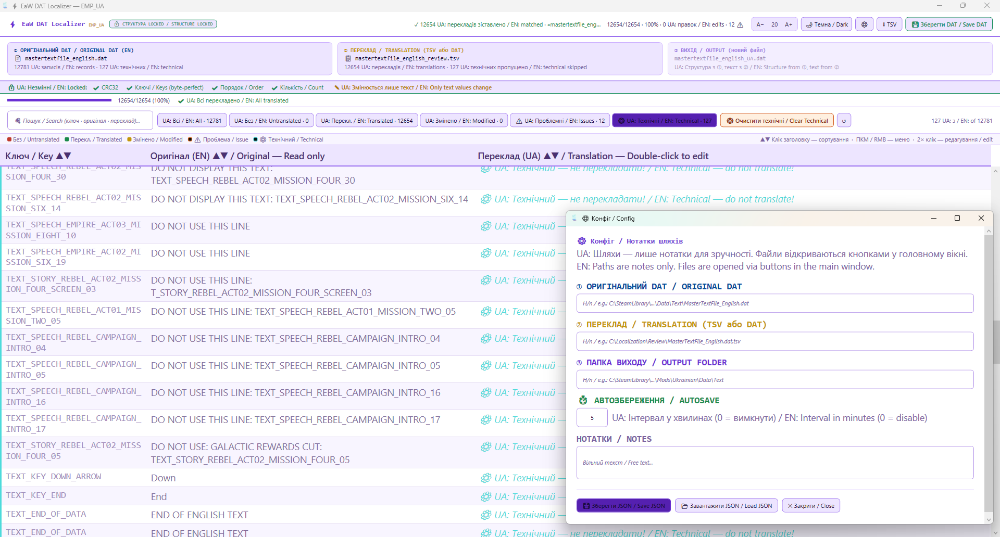
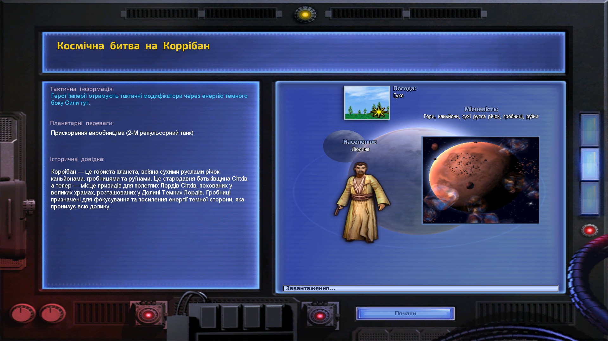
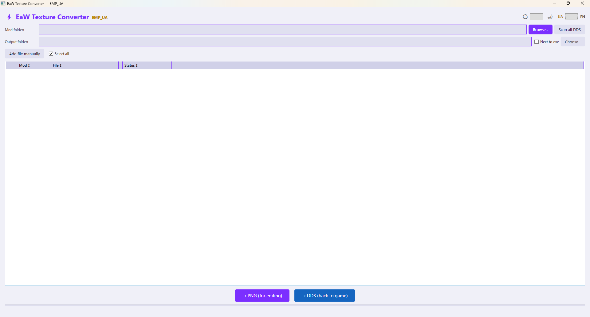
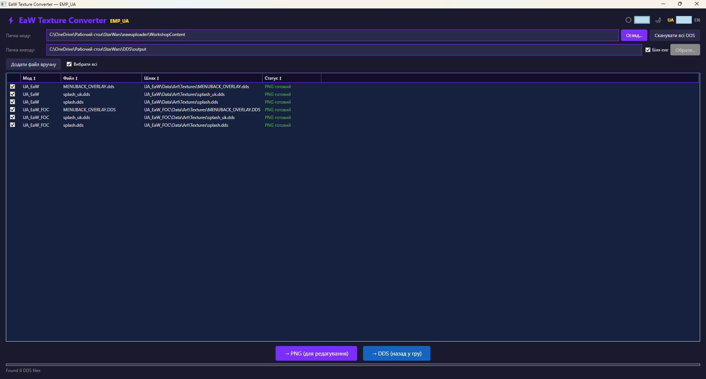

# Star Wars: Empire at War — Localization Toolset (by EMP_UA)

**UA:** Комплексний набір інструментів для локалізації ігор на рушії **Alamo** (Star Wars: Empire at War). Дозволяє автоматизувати процес від екстракції бінарних даних до інтелектуального перекладу за допомогою ШІ.  
**EN:** A comprehensive toolkit for localizing games built on the **Alamo** engine (Star Wars: Empire at War). It automates the entire pipeline, from binary data extraction to AI-powered translation.

---

## 🖥️ DAT Editor GUI / Редактор DAT файлів

**UA:** `EaWLocalizationTool.GUI` — WPF-редактор для ручного редагування та перевірки перекладів у `.dat` файлах рушія Alamo. Призначений для моддерів, яким потрібен повний контроль над локалізацією.

**EN:** `EaWLocalizationTool.GUI` — a WPF editor for manual editing and review of translations in Alamo engine `.dat` files. Designed for modders who need full control over localization.

### Можливості / Features
- **UA:** Завантаження оригінального DAT + джерела перекладу (TSV або інший DAT) / **EN:** Load original DAT + translation source (TSV or another DAT)
- **UA:** Фільтрація: Всі / Без перекладу / Перекладено / Змінено / Проблемні / Технічні / **EN:** Filters: All / Untranslated / Translated / Modified / Issues / Technical
- **UA:** Автоматична валідація: `\n`, `%s/%d`, `[теги]`, `<теги>` / **EN:** Auto-validation: `\n`, `%s/%d`, `[tags]`, `<tags>`
- **UA:** Розумне визначення технічних рядків: заглушки, роздільники crawl-тексту, фрази `DO NOT DISPLAY`, маркер `TEXT_END_OF_DATA` / **EN:** Smart detection of technical entries: placeholders, crawl-text separators, `DO NOT DISPLAY` phrases, `TEXT_END_OF_DATA` marker
- **UA:** Контекстне меню (ПКМ): копіювати оригінал, вставити оригінал як переклад, очистити переклад, копіювати ключ / **EN:** Context menu (RMB): copy original, paste original as translation, clear translation, copy key
- **UA:** Безпечний запис: CRC32 та ключі — побайтова копія оригіналу / **EN:** Safe write: CRC32 and keys — byte-perfect copy from original
- **UA:** Автозбереження: фоновий запис резервної копії (інтервал налаштовується, `0` = вимкнено) для захисту прогресу / **EN:** Autosave: background backup writing (configurable interval, `0` = disabled) to protect translation progress
- **UA:** Логування: автоматичний запис помилок та подій у файл для спрощення діагностики крашів / **EN:** Logging: automatic error and event recording to a file to simplify crash diagnostics
- **UA:** Темна / світла тема, масштабування шрифту / **EN:** Dark / light theme, font scaling
- **UA:** Експорт у TSV для роботи в Excel / Google Sheets / **EN:** Export to TSV for use in Excel / Google Sheets

### Скріншоти / Screenshots

### UA: Результат у грі / EN: In-game Result

### Завантаження / Download
Дивіться розділ [Releases](../../releases) → `EaWLocalizationTool.GUI_vX.X.zip`

**UA:** Вимоги: Windows 10/11 x64, [.NET 10 Desktop Runtime](https://dotnet.microsoft.com/download/dotnet/10.0)  
**EN:** Requirements: Windows 10/11 x64, [.NET 10 Desktop Runtime](https://dotnet.microsoft.com/download/dotnet/10.0)

---

## 🖼️ DDS Texture Converter / Конвертер DDS текстур

**UA:** `EaWTextureConverter` — WPF-інструмент для пакетної конвертації DDS-текстур між PNG і DDS без зовнішніх exe. Розроблено в контексті UA-моду, але сумісний з будь-яким модом EaW/FoC.

**EN:** `EaWTextureConverter` — a WPF tool for batch DDS↔PNG conversion without external executables. Built for the UA mod but compatible with any EaW/FoC mod.

### Можливості / Features
- **UA:** Рекурсивне сканування папки моду або ручне додавання DDS файлів / **EN:** Recursive mod folder scan or manual DDS file selection
- **UA:** Пакетна конвертація DDS → PNG зі збереженням альфа-каналу (через Magick.NET, підтримка DXT1/DXT3/DXT5) / **EN:** Batch DDS → PNG preserving alpha channel (via Magick.NET, DXT1/DXT3/DXT5 support)
- **UA:** Пакетна конвертація PNG → DDS — власний бінарний writer, uncompressed BGRA 32bpp / **EN:** Batch PNG → DDS — custom binary writer, uncompressed BGRA 32bpp
- **UA:** Формат виводу сумісний з DirectX 9 / рушієм Alamo — заголовок і маски ідентичні оригінальним файлам гри / **EN:** Output format compatible with DirectX 9 / Alamo engine — header and masks identical to original game files
- **UA:** Автоматичне визначення кореня моду по структурі `Data\Art` — без хардкоду назв, працює з будь-яким модом / **EN:** Automatic mod root detection via `Data\Art` structure — no hardcoded names, works with any mod
- **UA:** Підтримка обох структур EaW: `Data\Art\Textures` і `Data\patch2\DATA\ART\TEXTURES` / **EN:** Supports both EaW structures: `Data\Art\Textures` and `Data\patch2\DATA\ART\TEXTURES`
- **UA:** Збереження повної відносної структури папок у папці виводу / **EN:** Full relative folder structure preserved in output
- **UA:** Сортування по колонках, вибір/зняття всіх файлів, двомовний інтерфейс UA/EN / **EN:** Column sorting, select/deselect all, bilingual UA/EN interface
- **UA:** Темна і світла тема / **EN:** Dark and light theme
### Скріншоти / Screenshots

### Завантаження / Download
Дивіться розділ [Releases](../../releases) → `EaWTextureConverter_v1.0.0.zip`

**UA:** Вимоги: Windows 10/11 x64, [.NET 10 Desktop Runtime](https://dotnet.microsoft.com/download/dotnet/10.0)  
**EN:** Requirements: Windows 10/11 x64, [.NET 10 Desktop Runtime](https://dotnet.microsoft.com/download/dotnet/10.0)

---

## 🎬 Медіа / Media

- 📺 [Повна трансляція / Full stream](https://www.youtube.com/watch?v=YrQOiAzkuC4)
- 🎬 [Інтро українською / Intro in Ukrainian](https://www.youtube.com/shorts/NPhI2JCJ_Zo)
- 🎮 [Nexus Mods](https://www.nexusmods.com/starwarsempireatwar/mods/1876)
- 🎮 [Steam Workshop](https://steamcommunity.com/sharedfiles/filedetails/?id=3721022831)

---

## 🛡️ Technical Transparency / Технічна прозорість

**UA:** Для забезпечення безпеки та прозорості я надаю вихідний код усіх інструментів та логіку інсталятора:
* **Безпека:** Основні інструменти портативні та працюють без спеціальних прав. Скрипт `SetupFonts.bat` автоматично визначає версію ОС: на сучасних Windows (10 версії 1809+ та 11) він дозволяє встановлення шрифтів локально **без прав адміністратора**, а для старіших систем або глобального встановлення безпечно запитує підвищення прав через UAC.
* **Реєстр:** 
    * Інсталятор використовує **HKEY_CURRENT_USER** виключно для роботи деінсталятора та відстеження версії (запобігання дублюванню).
    * Скрипт `SetupFonts.bat` вносить зміни до гілки Fonts (у **HKEY_CURRENT_USER** або **HKEY_LOCAL_MACHINE** залежно від вибору) для офіційної реєстрації шрифтів у системі, що необхідно для рушія гри.
* **Приватність:** API-ключі Gemini вводяться користувачем вручну та не зберігаються в репозиторії.
* **Очищення:** Деінсталятор повністю видаляє всі файли локалізації, власні записи в реєстрі, а також **інтерактивно запитує** користувача перед автоматичним видаленням встановлених шрифтів із системи.

**EN:** To ensure safety and transparency, I am providing the source code for all tools and the installer logic:
* **Security:** Core tools are portable and run without special privileges. The `SetupFonts.bat` script automatically detects the OS version: on modern Windows (10 build 1809+ and 11), it allows local font installation **without administrator rights**. For older systems or global installation, it safely requests elevation via UAC.
* **Registry Use:** 
    * The installer uses **HKEY_CURRENT_USER** solely for uninstaller support and version tracking (to prevent duplication).
    * The `SetupFonts.bat` script modifies the Fonts branch (in **HKEY_CURRENT_USER** or **HKEY_LOCAL_MACHINE** depending on the user's choice) to officially register fonts, which is required by the game engine.
* **Privacy:** Gemini API keys are entered manually by the user and are not stored within the repository.
* **Cleanup:** The uninstaller completely removes all localization files, its own registry entries, and **interactively prompts** the user before automatically removing the installed fonts from the system.

---

## 🧰 Third-party Tools & Credits / Подяки

* **[Gemini API](https://ai.google.dev/):** **UA:** Основний лінгвістичний рушій для перекладу. **EN:** The primary linguistic engine used for translation.
* **[CsvHelper](https://joshclose.github.io/CsvHelper/):** **UA:** Для надійної обробки проміжних TSV-таблиць. **EN:** For robust processing of intermediate TSV tables.
* **[Inno Setup](https://jrsoftware.org/isinfo.php):** **UA:** Використовується для створення професійного пакета встановлення з підтримкою версійності. **EN:** Used to create a professional installation package with version detection support.
* **[Exo 2 Font](https://fonts.google.com/specimen/Exo+2):** **UA:** Використано як гармонійну базу для інтеграції українських символів в оригінальні шрифти гри. **EN:** Used as a matching base for integrating Ukrainian characters into the original game fonts.
* **[Magick.NET](https://github.com/dlemstra/Magick.NET):** **UA:** Декодування DDS (DXT1/DXT3/DXT5) у EaWTextureConverter. **EN:** DDS decoding (DXT1/DXT3/DXT5) in EaWTextureConverter.
* **[ImageSharp](https://github.com/SixLabors/ImageSharp):** **UA:** Обробка PNG у EaWTextureConverter. **EN:** PNG processing in EaWTextureConverter.
* **[BCnEncoder.NET](https://github.com/Nominom/BCnEncoder.NET):** **UA:** Бібліотека BCn-кодування у EaWTextureConverter (підключена; DXT не використовується — записуємо uncompressed BGRA). **EN:** BCn encoding library in EaWTextureConverter (included; DXT unused — we write uncompressed BGRA).

---

## ⚙️ Development Workflow / Робочий процес

**UA:** Цей проєкт є результатом складного технічного циклу:
1. **Extraction & Packaging:** Використання `EaWLocalizationTool` для розпакування бінарних `.dat`, обробки `XML` та реконструкції архівів із збереженням CRC32.
2. **AI-Enhanced Translation:** Використання `StarWarsLocalizer` для автоматизованого перекладу через Gemini API (3.1 Flash Lite / 2.5 Flash) з дворівневою перевіркою галюцинацій.
3. **Manual Review & Edit:** Використання `EaWLocalizationTool.GUI` для ручної перевірки, виправлення та збереження фінального DAT.
4. **Font Engineering:** Модифікація оригінальних шрифтів гри шляхом "підсадки" українських символів (на базі відкритого шрифту **Exo 2**) та налаштування метрик для коректного відображення в інтерфейсі.

**EN:** This project is the result of a complex technical workflow:
1. **Extraction & Packaging:** Using `EaWLocalizationTool` to unpack binary `.dat` files, process `XML`, and reconstruct archives while preserving CRC32.
2. **AI-Enhanced Translation:** Using `StarWarsLocalizer` for automated translation via Gemini API (3.1 Flash Lite / 2.5 Flash) with two-tier hallucination validation.
3. **Manual Review & Edit:** Using `EaWLocalizationTool.GUI` for manual review, correction, and saving the final DAT.
4. **Font Engineering:** Modifying original game fonts by blending in Ukrainian characters (based on the open-source **Exo 2** font) and adjusting metrics for correct UI display.

---

## 📂 Repository Structure / Структура репозиторію

* **/assets/fonts**
  * **UA:** Містить модифіковані шрифти (`.ttf`) та `SetupFonts.bat` для автоматизації їх підготовки та встановлення у систему.
  * **EN:** Contains modified fonts (`.ttf`) and `SetupFonts.bat` for automated preparation and system installation.
* **/assets/screenshots**
  * **UA:** Скріншоти GUI редактора та результату локалізації в грі.
  * **EN:** Screenshots of the GUI editor and in-game localization result.
* **/scr**
  * `/EaWLocalizationTool` — **UA:** Solution-папка, що містить три проєкти: / **EN:** Solution folder containing three projects:
    * `/EaWLocalizationTool` — **UA:** Консольний інструмент: екстракція XML/DAT/TXT у TSV-таблиці, зіставлення з перекладом, пакування назад в ігрові формати. **EN:** Console tool: extracts XML/DAT/TXT into TSV tables, merges with translation, and repacks into game formats.
    * `/EaWLocalizationTool.Core` — **UA:** Спільна бібліотека: парсинг/запис DAT, валідація, моделі. Використовується консоллю та GUI. **EN:** Shared library: DAT parsing/writing, validation, and models. Used by both the console and GUI.
    * `/EaWLocalizationTool.GUI` — **UA:** WPF-редактор DAT-файлів для ручного перекладу та перевірки. **EN:** WPF DAT file editor for manual translation and review.
  * `/EaWTextureConverter` — **UA:** WPF-інструмент для пакетної конвертації DDS-текстур між форматами PNG і DDS. Підтримує DXT1/DXT3/DXT5 декодування та запис uncompressed BGRA 32bpp, сумісний з рушієм Alamo (DirectX 9). **EN:** WPF tool for batch conversion of DDS textures between PNG and DDS formats. Supports DXT1/DXT3/DXT5 decoding and uncompressed BGRA 32bpp writing, compatible with the Alamo engine (DirectX 9).
  * `/MEGExtractor` — **UA:** Інструмент для роботи з `.meg` архівами гри. **EN:** Tool for handling game `.meg` archives.
  * `/StarWarsLocalizer` — **UA:** ШІ-перекладач на базі Gemini API. **EN:** AI translator based on the Gemini API.
* **/setup**
  * `packexe.iss` — **UA:** Текст скрипта для Inno Setup. Надає повну прозорість того, як файли розгортаються та видаляються з папки гри. **EN:** Inno Setup script text. Provides full transparency on how localization is deployed and uninstalled from the game directory.
* `.gitignore` — **UA:** Виключає конфіденційні файли (ключі) та тимчасові дані компіляції. **EN:** Excludes sensitive files (keys) and temporary build data.
* `LICENSE` — **UA:** Ліцензія проєкту. **EN:** Project license.

---

### ⚖️ Copyright Note / Примітка щодо авторських прав
**UA:** Усі модифіковані активи у папці `/assets` надаються виключно для некомерційного використання фанатами. Усі права на оригінальні активи належать розробникам гри.  
**EN:** All modified assets in the `/assets` folder are provided solely for non-commercial fan use. All rights to the original assets belong to the game developers.