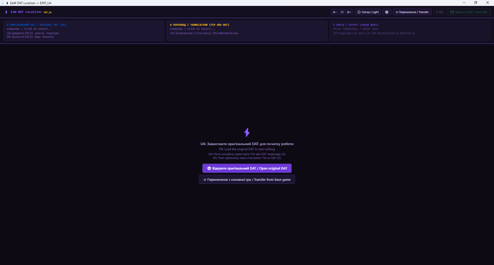
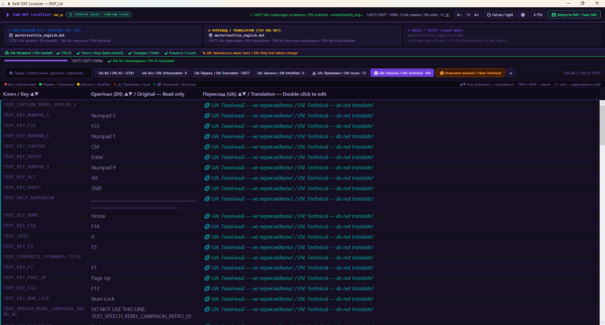
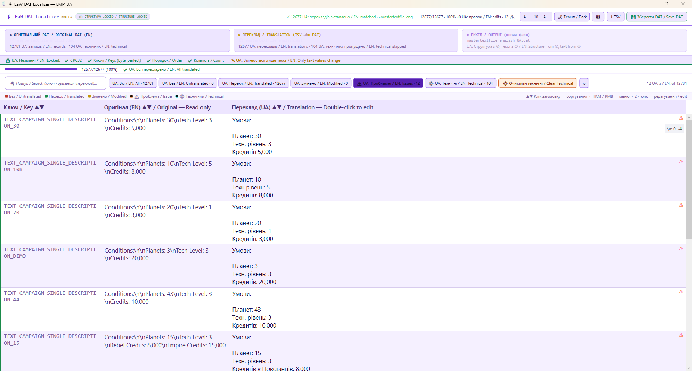
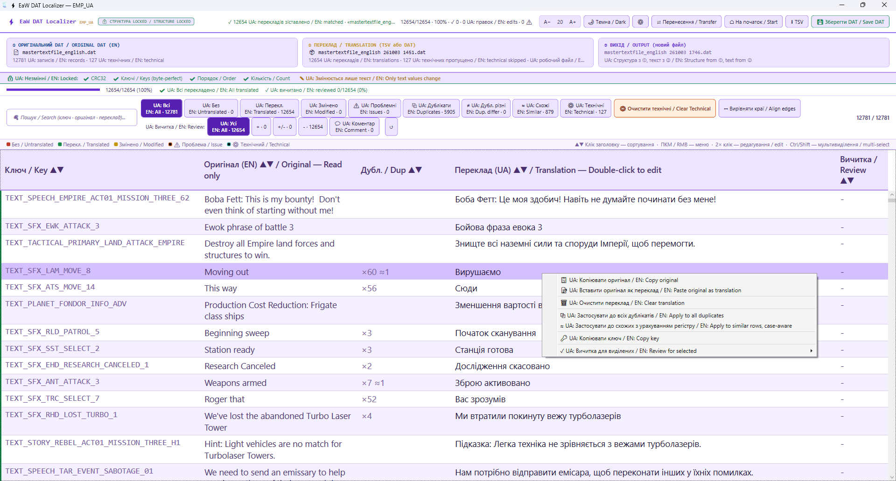
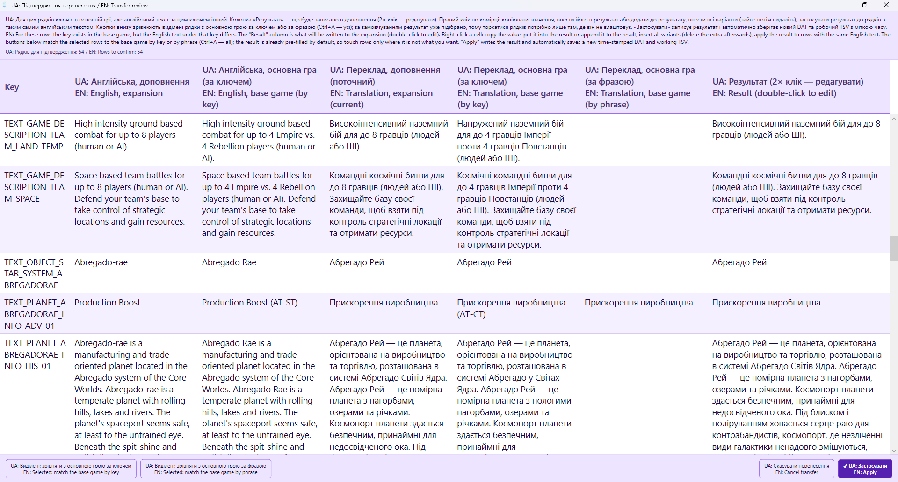
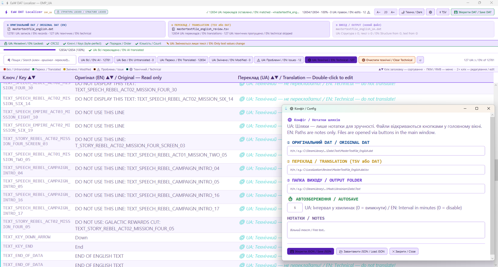
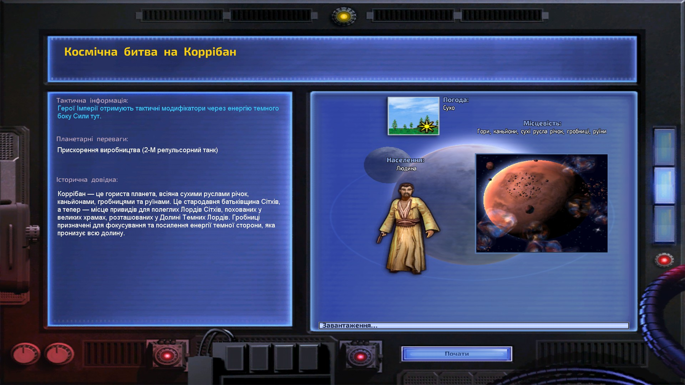
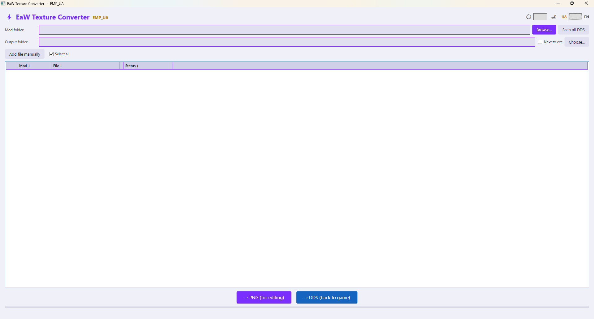
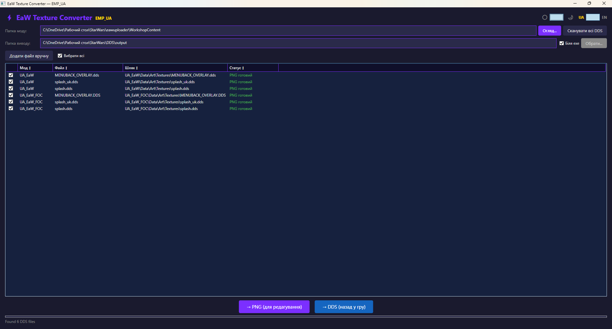

# SW_EaW-Localization-Suite-UA_EN

> Набір інструментів для локалізації Star Wars: Empire at War та Forces of Corruption (рушій Alamo)
> Localization toolset for Star Wars: Empire at War and Forces of Corruption (Alamo engine)

[](https://github.com/EMP-UA/SW_EaW-Localization-Suite-UA_EN/releases)
[](LICENSE)
[](https://github.com/EMP-UA/SW_EaW-Localization-Suite-UA_EN)
[](https://dotnet.microsoft.com/download/dotnet/10.0)

*Silence will fall.* ⚡

---

## UA: Що це

Комплексний набір інструментів для локалізації ігор на рушії **Alamo**
(**Star Wars: Empire at War** та доповнення **Forces of Corruption**). Охоплює весь
цикл: від розпакування бінарних даних і ШІ-перекладу до ручної вичитки, перенесення
перекладу між іграми та пакування готових файлів без втрати структури.

Увесь вихідний код відкритий: кожен крок, що виконується над файлами гри, можна
перевірити, а це потрібно для верифікації мода на майданчиках на кшталт Nexus Mods.

## EN: What this is

A comprehensive toolkit for localizing games built on the **Alamo** engine
(**Star Wars: Empire at War** and its **Forces of Corruption** expansion). It covers
the whole pipeline: from unpacking binary data and AI translation to manual review,
transferring translations between games, and repacking the finished files without
losing structure.

All source code is open: every step performed on the game files can be verified,
which is required for mod verification on platforms such as Nexus Mods.

---

## Склад набору / Toolset

| Інструмент / Tool | Призначення / Purpose | У релізі / In release |
|---|---|---|
| `EaWLocalizationTool.GUI` | WPF-редактор DAT: переклад, вичитка, перенесення між іграми / WPF DAT editor: translation, review, cross-game transfer | ✅ |
| `EaWTextureConverter` | Пакетна конвертація DDS ↔ PNG / Batch DDS ↔ PNG conversion | ✅ |
| `EaWLocalizationTool` | Консоль: XML/DAT/TXT → TSV, зіставлення, пакування / Console: XML/DAT/TXT → TSV, merge, repack | з коду / from source |
| `EaWLocalizationTool.Core` | Спільна бібліотека: DAT, валідація, моделі / Shared library: DAT, validation, models | — |
| `StarWarsLocalizer` | ШІ-перекладач на базі Gemini API / AI translator based on the Gemini API | з коду / from source |
| `MEGExtractor` | Робота з `.meg` архівами / `.meg` archive handling | з коду / from source |

---

## 🖥️ DAT Editor GUI / Редактор DAT файлів

**UA:** `EaWLocalizationTool.GUI` — WPF-редактор для ручного редагування та вичитки
перекладів у `.dat` файлах рушія Alamo. Призначений для моддерів, яким потрібен повний
контроль над локалізацією.

**EN:** `EaWLocalizationTool.GUI` — a WPF editor for manual editing and review of
translations in Alamo engine `.dat` files. Designed for modders who need full control
over localization.

### Можливості / Features

**UA:**
- ⇄ **Перенесення перекладу «основна гра → доповнення»** за ключем і за англійським текстом,
  із вікном підтвердження спірних рядків; результат пишеться в новий DAT — [опис](docs/TRANSFER.md)
- ✓ **Вичитка**: позначки `+`, `+/-`, `-` або коментар, окремі фільтри, лічильники,
  робочі TSV, збережені поруч із програмою — [опис](docs/REVIEW.md)
- Фільтри: Всі / Без перекладу / Перекладено / Змінено / Проблемні / Дублікати / Дубл. різні /
  Схожі / Технічні
- Автоматична валідація: `\n`, `\r`, `%s/%d`, `[теги]`, `<теги>`, `{модифікатори}`, пробіли й
  переноси на краях рядка
- Дублікати та схожі рядки; копіювання перекладу в групу, у тому числі з урахуванням регістру
- Безпечний запис DAT: CRC32 та ключі — побайтова копія оригіналу
- Автозбереження, журнал подій, експорт у TSV, темна / світла тема

Повний список — [docs/EDITOR.md](docs/EDITOR.md).

**EN:**
- ⇄ **"Base game → expansion" translation transfer** by key and by English text, with a
  confirmation window for disputed rows; the result is written to a new DAT —
  [details](docs/TRANSFER.md)
- ✓ **Review**: `+`, `+/-`, `-` marks or a comment, separate filters, counters, working TSVs
  kept next to the application — [details](docs/REVIEW.md)
- Filters: All / Untranslated / Translated / Modified / Issues / Duplicates / Dup. differ /
  Similar / Technical
- Auto-validation: `\n`, `\r`, `%s/%d`, `[tags]`, `<tags>`, `{modifiers}`, whitespace and line
  breaks at the edges of a string
- Duplicates and similar rows; copying a translation to the group, including case-aware copying
- Safe DAT write: CRC32 and keys are a byte-perfect copy of the original
- Autosave, event log, TSV export, dark / light theme

Full list — [docs/EDITOR.md](docs/EDITOR.md).

### Скріншоти / Screenshots








### UA: Результат у грі / EN: In-game Result



---

## 🖼️ DDS Texture Converter / Конвертер DDS текстур

**UA:** `EaWTextureConverter` — WPF-інструмент для пакетної конвертації DDS-текстур між PNG і
DDS без зовнішніх exe. Розроблено в контексті UA-мода, але сумісний з будь-яким модом EaW/FoC.

**EN:** `EaWTextureConverter` — a WPF tool for batch DDS↔PNG conversion without external
executables. Built for the UA mod but compatible with any EaW/FoC mod.

### Можливості / Features

- **UA:** Рекурсивне сканування папки мода або ручне додавання DDS файлів / **EN:** Recursive mod folder scan or manual DDS file selection
- **UA:** Пакетна конвертація DDS → PNG зі збереженням альфа-каналу (через Magick.NET, підтримка DXT1/DXT3/DXT5) / **EN:** Batch DDS → PNG preserving alpha channel (via Magick.NET, DXT1/DXT3/DXT5 support)
- **UA:** Пакетна конвертація PNG → DDS — власний бінарний writer, uncompressed BGRA 32bpp / **EN:** Batch PNG → DDS — custom binary writer, uncompressed BGRA 32bpp
- **UA:** Формат виводу сумісний з DirectX 9 / рушієм Alamo — заголовок і маски ідентичні оригінальним файлам гри / **EN:** Output format compatible with DirectX 9 / Alamo engine — header and masks identical to original game files
- **UA:** Автоматичне визначення кореня мода за структурою `Data\Art` — без жорстко заданих назв, працює з будь-яким модом / **EN:** Automatic mod root detection via `Data\Art` structure — no hardcoded names, works with any mod
- **UA:** Підтримка обох структур EaW: `Data\Art\Textures` і `Data\patch2\DATA\ART\TEXTURES` / **EN:** Supports both EaW structures: `Data\Art\Textures` and `Data\patch2\DATA\ART\TEXTURES`
- **UA:** Збереження повної відносної структури папок у папці виводу / **EN:** Full relative folder structure preserved in output
- **UA:** Сортування за колонками, вибір/зняття всіх файлів, двомовний інтерфейс UA/EN / **EN:** Column sorting, select/deselect all, bilingual UA/EN interface
- **UA:** Темна і світла тема / **EN:** Dark and light theme

### Скріншоти / Screenshots




---

## Встановлення / Installation

**Вимоги / Requirements:**
- Windows 10/11
- Star Wars: Empire at War і/або Forces of Corruption
- [.NET 10 Desktop Runtime](https://dotnet.microsoft.com/download/dotnet/10.0) — лише для
  варіанту `generic`; збірки `win-x64` та `win-x86` самодостатні, .NET встановлювати не треба
- [.NET 10 SDK](https://dotnet.microsoft.com/download/dotnet/10.0) — лише для збірки з коду

**Готовий білд / Prebuilt release:**

**UA:** Дивіться [Releases](https://github.com/EMP-UA/SW_EaW-Localization-Suite-UA_EN/releases).
Кожен реліз містить обидва інструменти в трьох варіантах і файл `SHA256SUMS.txt` із
контрольними сумами:

**EN:** See [Releases](https://github.com/EMP-UA/SW_EaW-Localization-Suite-UA_EN/releases).
Every release contains both tools in three variants plus a `SHA256SUMS.txt` file with
checksums:

| Варіант / Variant | Архів / Archive | Опис / Description |
|---|---|---|
| `win-x64` | `EaWLocalizationTool.GUI_vX.Y.Z_win-x64.zip`<br>`EaWTextureConverter_vX.Y.Z_win-x64.zip` | UA: самодостатня збірка для 64-бітної Windows / EN: self-contained build for 64-bit Windows |
| `win-x86` | `EaWLocalizationTool.GUI_vX.Y.Z_win-x86.zip`<br>`EaWTextureConverter_vX.Y.Z_win-x86.zip` | UA: самодостатня збірка для 32-бітної Windows / EN: self-contained build for 32-bit Windows |
| `generic` | `EaWLocalizationTool.GUI_vX.Y.Z_generic.zip`<br>`EaWTextureConverter_vX.Y.Z_generic.zip` | UA: малий розмір, потребує .NET 10 Desktop Runtime / EN: small size, requires the .NET 10 Desktop Runtime |

**UA:** Архіви збирає GitHub Actions ([`release.yml`](.github/workflows/release.yml)) з
вихідного коду тега — готові файли не завантажуються вручну; походження архіву можна
перевірити командою `gh attestation verify` ([докладно](docs/RELEASES.md)). Історія змін
релізів — [`CHANGELOG.md`](CHANGELOG.md).

**EN:** The archives are built by GitHub Actions ([`release.yml`](.github/workflows/release.yml))
from the tag's source code — no prebuilt files are uploaded by hand; an archive's origin can be
verified with `gh attestation verify` ([details](docs/RELEASES.md)). The release history is in
[`CHANGELOG.md`](CHANGELOG.md).

**Збірка з коду / Build from source:**

```
dotnet build scr/EaWLocalizationTool/EaWLocalizationTool.slnx -c Release
dotnet build scr/EaWTextureConverter/EaWTextureConverter.csproj -c Release
```

**Інсталятор мода (Inno Setup) / Mod installer (Inno Setup):**

**UA:** [`setup/packexe.iss`](setup/packexe.iss) — скрипт інсталятора українізатора. Він
показує, як файли розгортаються та видаляються з теки гри. Базова гра розгортається в
`GameData\Mods\UA_EaW`, Forces of Corruption — у `corruption\Mods\UA_EaW_FOC`.

**EN:** [`setup/packexe.iss`](setup/packexe.iss) — the localization installer script. It shows
how files are deployed to and removed from the game folder. The base game goes to
`GameData\Mods\UA_EaW`, Forces of Corruption to `corruption\Mods\UA_EaW_FOC`.

---

## ⚙️ Робочий процес / Workflow

**UA:**
1. **Екстракція та пакування:** `EaWLocalizationTool` розпаковує бінарні `.dat`, обробляє `XML` і
   збирає архіви назад зі збереженням CRC32.
2. **Переклад за допомогою ШІ:** `StarWarsLocalizer` перекладає через Gemini API
   (3.1 Flash Lite / 2.5 Flash) з дворівневою перевіркою галюцинацій.
3. **Вичитка та правки:** `EaWLocalizationTool.GUI` — ручна перевірка, позначки вичитки,
   виправлення та збереження фінального DAT.
4. **Доповнення:** переклад основної гри переноситься у DAT Forces of Corruption кнопкою
   «⇄ Основна гра → доповнення»; вичитані рядки при цьому лишаються незмінними.
5. **Шрифти:** оригінальні шрифти гри доповнюються українськими символами (на основі
   відкритого шрифту **Exo 2**), метрики налаштовуються для коректного відображення в інтерфейсі.
6. **Текстури:** `EaWTextureConverter` конвертує текстури інтерфейсу між DDS і PNG.

**EN:**
1. **Extraction and packaging:** `EaWLocalizationTool` unpacks binary `.dat` files, processes
   `XML` and rebuilds archives preserving CRC32.
2. **AI translation:** `StarWarsLocalizer` translates through the Gemini API
   (3.1 Flash Lite / 2.5 Flash) with two-tier hallucination validation.
3. **Review and edits:** `EaWLocalizationTool.GUI` — manual checking, review marks,
   corrections and saving the final DAT.
4. **Expansion:** the base game's translation is transferred into the Forces of Corruption DAT
   with the "⇄ Base game → expansion" button; reviewed rows stay untouched.
5. **Fonts:** the game's original fonts are extended with Ukrainian glyphs (based on the
   open-source **Exo 2** font), with metrics adjusted for correct display in the interface.
6. **Textures:** `EaWTextureConverter` converts interface textures between DDS and PNG.

---

## 🎬 Медіа / Media

- 📺 [Повна трансляція / Full stream](https://www.youtube.com/watch?v=YrQOiAzkuC4)
- 🎬 [Інтро українською / Intro in Ukrainian](https://www.youtube.com/shorts/NPhI2JCJ_Zo)
- 🎮 [Nexus Mods](https://www.nexusmods.com/starwarsempireatwar/mods/1876)
- 🎮 [Steam Workshop](https://steamcommunity.com/sharedfiles/filedetails/?id=3721022831)

---

## 🛡️ Технічна прозорість / Technical Transparency

**UA:** Для безпеки та прозорості вихідний код усіх інструментів і логіка інсталятора відкриті:
* **Безпека:** основні інструменти портативні й працюють без спеціальних прав. Скрипт
  `SetupFonts.bat` визначає версію ОС: на сучасних Windows (10 версії 1809+ та 11) він встановлює
  шрифти локально **без прав адміністратора**, а для старіших систем або глобального встановлення
  запитує підвищення прав через UAC.
* **Реєстр:**
    * Інсталятор використовує **HKEY_CURRENT_USER** виключно для роботи деінсталятора та
      відстеження версії (запобігання дублюванню).
    * `SetupFonts.bat` вносить зміни до гілки Fonts (у **HKEY_CURRENT_USER** або
      **HKEY_LOCAL_MACHINE** залежно від вибору) для реєстрації шрифтів у системі, що потрібно
      рушію гри.
* **Приватність:** ключі Gemini API вводить користувач вручну; у репозиторії вони не зберігаються.
* **Робочі файли:** GUI пише лише поруч зі своїм виконуваним файлом: `logs\` (журнал),
  `original\`, `translated\`, `work\`, `transfer\` (див. «Теки програми»), `ui_settings.json`. Мережевих з'єднань GUI не встановлює.
* **Збірка:** релізні архіви створює GitHub Actions з вихідного коду тега; до кожного релізу
  додаються `SHA256SUMS.txt` і підтвердження походження збірки ([докладно](docs/RELEASES.md)).
* **Очищення:** деінсталятор видаляє всі файли локалізації, власні записи в реєстрі та
  **інтерактивно запитує** користувача перед видаленням встановлених шрифтів.

**EN:** For safety and transparency, the source code of all tools and the installer logic are open:
* **Security:** the core tools are portable and run without special privileges. The
  `SetupFonts.bat` script detects the OS version: on modern Windows (10 build 1809+ and 11) it
  installs fonts locally **without administrator rights**; for older systems or a global install it
  requests elevation via UAC.
* **Registry use:**
    * The installer uses **HKEY_CURRENT_USER** solely for uninstaller support and version
      tracking (to prevent duplication).
    * `SetupFonts.bat` modifies the Fonts branch (in **HKEY_CURRENT_USER** or
      **HKEY_LOCAL_MACHINE** depending on the choice) to register fonts, which the game engine requires.
* **Privacy:** Gemini API keys are entered manually by the user and are not stored in the repository.
* **Working files:** the GUI writes only next to its own executable: `logs\` (log),
  `original\`, `translated\`, `work\`, `transfer\` (see "Application folders"), `ui_settings.json`. The GUI makes no network connections.
* **Build:** release archives are produced by GitHub Actions from the tag's source code; every
  release carries a `SHA256SUMS.txt` and a build provenance attestation ([details](docs/RELEASES.md)).
* **Cleanup:** the uninstaller removes all localization files and its own registry entries, and
  **interactively asks** the user before removing the installed fonts.

---

## 📂 Структура репозиторію / Repository Structure

```
SW_EaW-Localization-Suite-UA_EN/
├── .github/
│   ├── ISSUE_TEMPLATE/                    # Шаблони звернень / Issue templates
│   └── workflows/
│       └── release.yml                    # Збірка та публікація релізу / Release build and publish
├── docs/
│   ├── EDITOR.md                          # Можливості редактора / Editor features
│   ├── TRANSFER.md                        # Перенесення перекладу / Translation transfer
│   ├── REVIEW.md                          # Вичитка, робочі файли, теки / Review, working files, folders
│   └── RELEASES.md                        # Релізи та перевірка збірок / Releases and build verification
├── assets/
│   ├── fonts/                             # Шрифти (.ttf) та SetupFonts.bat / Fonts (.ttf) and SetupFonts.bat
│   └── screenshots/                       # Скріншоти GUI та гри / GUI and in-game screenshots
├── scr/
│   ├── EaWLocalizationTool/               # Solution: консоль + Core + GUI / console + Core + GUI
│   │   ├── EaWLocalizationTool/           # Консоль: XML/DAT/TXT → TSV, зіставлення, пакування
│   │   │                                  # Console: XML/DAT/TXT → TSV, merge, repack
│   │   ├── EaWLocalizationTool.Core/      # DAT (читання/безпечний запис), TSV, перенесення перекладу
│   │   │                                  # DAT (read/safe write), TSV, translation transfer
│   │   └── EaWLocalizationTool.GUI/       # WPF-редактор DAT / WPF DAT editor
│   ├── EaWTextureConverter/               # WPF: DDS ↔ PNG
│   ├── MEGExtractor/                      # Робота з .meg архівами / .meg archive handling
│   └── StarWarsLocalizer/                 # ШІ-перекладач на базі Gemini API / Gemini API AI translator
├── setup/
│   └── packexe.iss                        # Скрипт Inno Setup / Inno Setup script
├── CHANGELOG.md                           # Історія змін релізів GUI та конвертера текстур
│                                          # Release history of the GUI and the texture converter
├── LICENSE
└── README.md
```

---

## 🧰 Сторонні інструменти та подяки / Third-party Tools & Credits

* **[Gemini API](https://ai.google.dev/):** **UA:** основний лінгвістичний рушій для перекладу. **EN:** the primary linguistic engine used for translation.
* **[CsvHelper](https://joshclose.github.io/CsvHelper/):** **UA:** надійна обробка проміжних TSV-таблиць. **EN:** robust processing of intermediate TSV tables.
* **[Inno Setup](https://jrsoftware.org/isinfo.php):** **UA:** створення пакета встановлення з підтримкою версійності. **EN:** building the installation package with version detection support.
* **[Exo 2](https://fonts.google.com/specimen/Exo+2)** (Natanael Gama, SIL Open Font License): **UA:** основа для інтеграції українських символів в оригінальні шрифти гри. **EN:** the base for blending Ukrainian characters into the game's original fonts.
* **[Magick.NET](https://github.com/dlemstra/Magick.NET):** **UA:** декодування DDS (DXT1/DXT3/DXT5) в EaWTextureConverter. **EN:** DDS decoding (DXT1/DXT3/DXT5) in EaWTextureConverter.
* **[ImageSharp](https://github.com/SixLabors/ImageSharp):** **UA:** обробка PNG в EaWTextureConverter. **EN:** PNG processing in EaWTextureConverter.
* **[BCnEncoder.NET](https://github.com/Nominom/BCnEncoder.NET):** **UA:** бібліотека BCn-кодування в EaWTextureConverter (підключена; DXT не використовується — записується uncompressed BGRA). **EN:** BCn encoding library in EaWTextureConverter (included; DXT is unused — uncompressed BGRA is written).
* **[CommunityToolkit.Mvvm](https://github.com/CommunityToolkit/dotnet):** **UA:** MVVM-каркас EaWTextureConverter. **EN:** the MVVM framework of EaWTextureConverter.

---

## 💜 Підтримка / Support the Project

**UA:** Якщо інструменти виявилися корисними — підтримати можна тут:
**EN:** If you find these tools useful — support is appreciated:

- ☕ [Ko-fi](https://ko-fi.com/emp_ua) — **EN:** International
- 🏦 [Monobank](https://send.monobank.ua/jar/7PnVgizntU) — **UA:** Україна
- 💳 [StreamElements](https://streamelements.com/emp_ua/tip) — PayPal

---

## 📺 Автор / Author

**EMP_UA** — **UA:** Український контент-мейкер та локалізатор ігор. **EN:** Ukrainian content creator & game localizer.
[YouTube](https://www.youtube.com/@EMPs_UA) • [Twitch](https://www.twitch.tv/emp_ua) • [Discord](https://discord.gg/QdmgsCgPkp) • [Telegram](https://t.me/EMP_UA) • [Website](https://emp-ua.com)

---

### ⚖️ Copyright Note / Примітка щодо авторських прав

**UA:** Увесь код і скрипти в цьому репозиторії — авторська робота, надана виключно для некомерційного використання фанатами та для технічної прозорості перед майданчиками модів (напр. Nexus Mods). Усі права на оригінальні активи, тексти та бінарні формати гри належать їхнім правовласникам; цей репозиторій не містить видобутих файлів гри. Модифіковані шрифти в `/assets/fonts` надаються лише для некомерційного використання.

**EN:** All code and scripts in this repository are original work, provided solely for non-commercial fan use and for technical transparency toward mod platforms (e.g. Nexus Mods). All rights to the original assets, text, and binary formats belong to their respective rights holders; this repository contains no extracted game files. The modified fonts in `/assets/fonts` are provided for non-commercial use only.

---

*© EMP_UA — MIT License*
